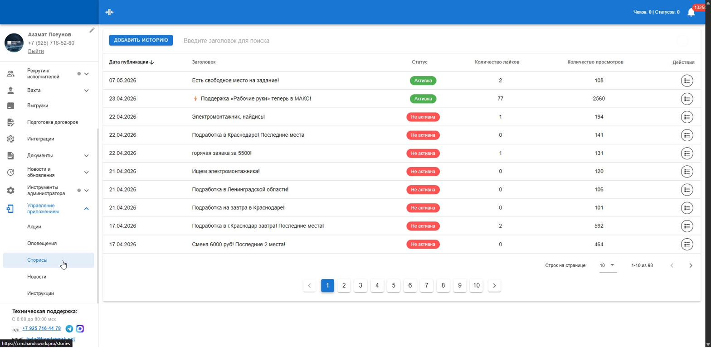
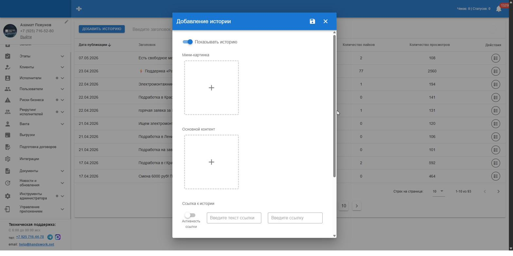

# Сторисы — прототип админки

Прототип раздела **«Сторисы»** для CRM «Рабочие руки»: редактор, аналитика, шаблоны. Vite + React 18 + Tailwind CSS, без бэкенда — данные в памяти.

## Скриншоты

Текущий вид сайдбара CRM (для контекста):



Так выглядит существующий раздел «Сторисы» в проде:



## Что в прототипе

**Редактор сторис.** Слева — превью на телефоне (sticky), справа — карточки полей: контент с палитрой, текст, ссылки, кнопка «Связаться», аудитория, опрос, реакции, расписание, A/B-тест, доплаты, UTM. Тулбар сверху — хлебная крошка + кнопки `История версий / Дублировать / Сохранить черновик / Опубликовать`. Никаких метрик в редакторе — они появляются только после публикации, во вкладке «Аналитика».

**Аналитика.** Пять KPI (просмотры, клики, записи, выходы на смену, конверсия), воронка, кривая досмотра видео, heatmap CTR по часу/дню, бары по городам, динамика по дням, опрос «Откуда узнали», реакции, сравнительная таблица всех сторис с ROI и таблица исполнителей с фильтрами и Excel-выгрузкой. Подробное описание — в [docs/analytics_panel_overview.md](docs/analytics_panel_overview.md).

**Список сторис и шаблоны.** Таблица со статусами и фильтрами; шаблоны для быстрого старта («Срочная смена», «Опрос», «Реферальная программа» и т.д.).

## Запуск

Нужен **Node.js 18+** ([nodejs.org](https://nodejs.org/)).

```bash
npm install
npm run dev
```

Откроется `http://localhost:5173`.

## Структура

```
.
├── src/
│   ├── main.jsx
│   ├── index.css
│   └── stories_admin_prototype.jsx   ← основной прототип (~3200 строк)
├── docs/
│   ├── analytics_panel_overview.md   ← описание панели аналитики по отделам
│   ├── stories_editor_mockup.html    ← standalone HTML-макет с CRM-фреймом
│   ├── screenshots/                  ← скриншоты текущей CRM
│   └── examples/                     ← примеры xlsx-выгрузок
├── package.json
├── vite.config.js
├── tailwind.config.js
├── postcss.config.js
└── index.html
```

## Стек

- **React 18** — UI
- **Vite 5** — сборщик и dev-сервер
- **Tailwind CSS 3** — стили
- **lucide-react** — иконки
- **recharts** — графики

## HTML-макет без сборки

В `docs/stories_editor_mockup.html` лежит standalone-версия с тем же CRM-фреймом (сайдбар, хедер, вкладки, редактор, аналитика на Chart.js). Открывается двойным кликом — Node.js не нужен. Полезно для быстрого показа дизайна без установки зависимостей.

## Лицензия

MIT — см. [LICENSE](LICENSE).
